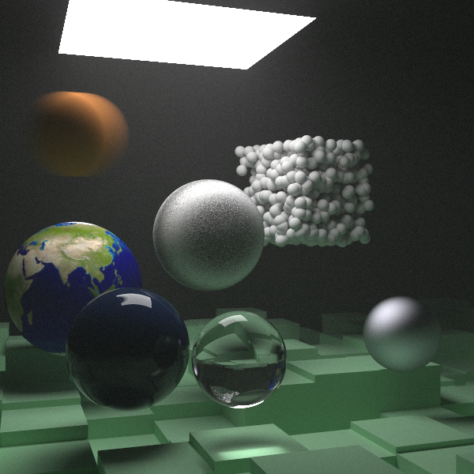

# Multicore_ParallelRayTracing

Final Project for Multicore Processors Course at NYU: Parallel Ray Tracing Algorithm\
**Team Member:** Hanlin He, Yaowei Zong, Wenbo Song

## Source Code

**Intent**\
This repository is the skeleton of a ray tracer which will be modified to a parallel version as the final project of Multicore Processor Fall 2021 at NYU.\
\
**Downloading The Source Code**\
This project is mostly writen in C++, to clone the repository, you can

```zsh
git clone git@github.com:HerlinHe/Multicore_ParallelRayTracing.git
```

Remember to create a new brach when you do your part of work.\
\
**Build and Run**\
You need create a ```build``` directory in the root and run program there, do not generate binary file outside of it.

```zsh
mkdir build
cd build
cmake -DCMAKE_BUILD_TYPE=Release -DCMAKE_CXX_COMPILER=<Your G++ Compiler> ..
make
./parallel_ray_tracing <number of threads>
```

Making ```-DCMAKE_BUILD_TYPE``` to ```Release``` then you can accelerate your program.

The option ```-DCMAKE_CXX_COMPILER``` specify your compiler, you should choose g++ which support openMP. If not specify the compiler, it will use your default compiler and may cause "Undefined symbols" error. The g++ version I use is g++11.\
\
**What You should Get**\
If you choose ```world=random_scene()``` in the ```main``` function and set ```image_width``` to 1200, then you can get the following image following the instruction. It takes me about 25mins to produce this picture with one thread on my laptop, a Macbook Pro 16' with Intel processor. And four threads can achieve triple accelerating.


A more complicated scene can be rendered when you set ```world=final_scene()``` in the ```main``` function. It takes me about 160mins to render this picture with one thread.
<p align="center">
  
</p>
